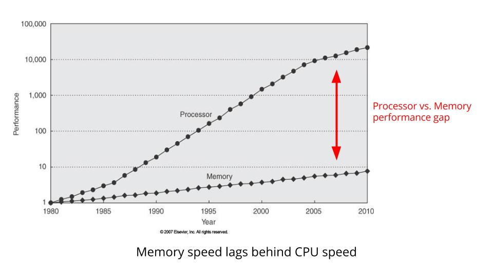

= Compare Go Distributed Programming with Kotlin
Andreas Martin Klinger <andreas.b.klinger@stud.th-rosenheim.de>
1.0, January 10, 2021
:description: Semester work on the comparison of distributed programming in Go and Kotlin
ifdef::env-github[]
:go-source: https://github.com/KlingerA/concepts-of-programming-languages/tree/master/go-examples
:kotlin-source: https://github.com/KlingerA/concepts-of-programming-languages/tree/master/kotlin-examples/src/main/kotlin
endif::[]
ifndef::env-github[]
:go-source: ./go-examples
:kotlin-source: ./kotlin-examples/src/main/kotlin
endif::[]
:figure-caption: Figure
:toc: macro

[discrete]
===== Rosenheim Technical University of Applied Sciences

[discrete]
=== Semester work in concepts of programming languages

[discrete]
== Compare Go Distributed Programming with Kotlin

[discrete]
==== Author: Andreas Martin Klinger

'''
<<<

[[Text]]
== Abstract

...

'''
<<<

[[numbered]]
toc::[]

<<<

[[Text]]
:numbered:

[#header-introduction]
== Introduction

Distributed systems have always been of paramount importance in software development. For example, when you do a Google search, buy an item from Amazon, or watch a series on Netflix, you are using distributed systems.

This work will look at what distributed systems are in the first place, what they have to do with distributed programs, and finally, what distributed programming is. Furthermore, the programming languages Go and Kotlin will be compared in terms of the implementation of some concepts of distributed programming.

[#header-introduction-go]
=== Introduction to Go

Go, also called Golang, is an open-source programming language first developed by Google employees in 2009. It was originally developed for systems programming. Modern approaches such as concurrency and the garbage collector ensure exceptional performance. Parallelization is also one of its strengths. Go is particularly popular when it comes to scalable cloud applications (Augsten 2020a).

[#header-introduction-kotlin]
=== Introduction to Kotlin

Kotlin is an object-oriented programming language developed by the Czech company JetBrains. It was first released in 2011 and the first stable version appeared in 2016. It can be transformed into JavaScript source code as well as into byte code for the Java Virtual Machine (JVM). Kotlin's strengths include full compatibility with Java and fast lambda expressions. In addition to server-side applications, Kotlin is also excellent for developing Android apps (Augsten 2020b).

<<<

[#header-distributed-programming]
== Distributed systems and programming

In order to understand distributed programming, some terms and relationships must first be defined. First, the concept of distributed systems will be explained. According to Toal (n.d.), this is a system of computers that communicate by messages over a network to work together on one or more tasks. Also, in a distributed system there is no shared physical memory, although this can be simulated by algorithms. In addition, processes here run on different networked processors (Saumweber 2020, p. 3). In summary, a distributed system is a collection of software and hardware components called nodes, which are interconnected over a network and together perform different logical operations. Ultimately, the complexity is hidden from the end user and the whole system appears to them as one computer (The TechCave 2019, 1:01-2:01).

According to Andrews (2000), a program that operates in a distributed system is a distributed program and the process of developing it is called distributed programming.

<<<

[#header-comparison]
== Comparison between Go and Kotlin

This chapter will now compare Go and Kotlin based on certain concepts of distributed programming. First, scalability and concurrency will be discussed in more detail. Then the focus is placed on performance. Finally, a few similarities and differences between the two programming languages will be shown using a code example.

[#header-comparison-1]
=== Scalability and concurrency

Scalability plays a central role in the development of distributed systems. Today, for example, it is important to expand software systems both vertically, i.e. by adding more memory or computing power, or horizontally, i.e. by adding an additional server instance.

While many programming languages use threads and consume a lot of memory in the process, Go uses so-called goroutines. These run - if needed - simultaneously and independently of each other. They require only 2 kB of memory and thus allow Go to process several tasks concurrently (Marshall 2020).

[#goroutines,source,go,linenums,caption='',title='{figure-caption} {counter:refnum} - Goroutines (Ramanathan 2020)']
----
include::{go-source}/goroutines.go[lines=13..30]
----

<<goroutines>> shows the exemplary implementation of goroutines. Two goroutines `numbers` and `alphabets` are started, which then run simultaneously and output the following:

[source,log]
----
1 a 2 3 b 4 c 5 d e
----

Kotlin, on the other hand, normally works multi-threaded. The equivalent to goroutines in Kotlin are so-called coroutines. However, these must first be activated and added as a dependency.

[#coroutines,source,kotlin,linenums,caption='',title='{figure-caption} {counter:refnum} - Coroutines']
----
include::{kotlin-source}/coroutines.kt[lines=9..31]
----

<<coroutines>> shows the corresponding implementation in Kotlin. Here, as in the previous example, the functions `numbers` and `alphabets` are called. The output is also the same:

[source,log]
----
1 a 2 3 b 4 c 5 d e
----

[#header-comparison-2]
=== Performance

Another comparison will shed light on the performance of Go and Kotlin. This may seem irrelevant nowadays against the background of ever more memory.

[#memory-speed-lags-behing-cpu-speed,caption='',title='{figure-caption} {counter:refnum} - Memory speed lags behind CPU speed (Cheney 2014)']

However, <<memory-speed-lags-behing-cpu-speed>> shows that the memory speed is increasingly lagging behind that of the CPU. It follows that the CPU has to "wait" longer and longer for the memory (Cheney 2014). Therefore, a high-performance programming language is extremely important, even or even more so in today's world - especially when it comes to the cost of distributed systems.

While Go is built directly in binaries, Kotlin is built in byte code, which runs in the Java Virtual Machine. This creates an additional layer of overhead. Below you can see how much memory an integer number `var x int32 = 2021` requires in both languages (Huynh 2020):

* Go: 4 bytes
* Kotlin: 4 bytes but if used in map, 16 for x32, 24 for x64 JVM

From this it can be concluded that with a strong focus on performance, Go can be preferred over Kotlin.

[#header-comparison-3]
=== Socket server and client

The implementation of client-server applications is extremely important when it comes to the development of distributed systems. The following examples demonstrate the use of sockets in Go and Kotlin.

[#go-socket-server,source,go,linenums,caption='',title='{figure-caption} {counter:refnum} - Go socket server (Wiiliams 2020)']
----
include::{go-source}/socket-server.go[lines=22..53]
----

[#go-socket-client,source,go,linenums,caption='',title='{figure-caption} {counter:refnum} - Go socket client (Williams 2020)']
----
include::{go-source}/socket-client.go[lines=22..39]
----

[#kotlin-socket-server,source,kotlin,linenums,caption='',title='{figure-caption} {counter:refnum} - Kotlin socket server (Mogensen 2018)']
----
include::{kotlin-source}/socket-server.kt[lines=13..33;40..67]
----

[#kotlin-socket-client,source,koltin,linenums,caption='',title='{figure-caption} {counter:refnum} - Kotlin socket client (Mogensen 2018)']
----
include::{kotlin-source}/socket-client.kt[lines=19..52]
----

Both implementations consist of a `socket-server` (<<go-socket-server>>, <<kotlin-socket-server>>) and a `socket-client` (<<go-socket-client>>, <<kotlin-socket-client>>). The client can also be started multiple times.

The server is initialized at Go using the `net` package. With Kotlin you can see the close connection to Java and `java.net.ServerSocket` is used for it.

One difference in this implementation is that the Go example uses coroutines (`go handleConnection(c)`), while the Kotlin implementation uses classic threads (`thread { ClientHandler(client).run() }`).

<<<

[#header-discussion-conclusion]
== Discussion and conclusion

This work, in addition to a brief introduction to distributed programming, was intended to make a comparison between Go and Kotlin. It became clear that both languages are suitable for the development of distributed systems.

By goroutines and/or coroutines it became clear that certain programming concepts, which are possibly necessary for distributed systems, find application in both languages. With the performance indicators could be found, which Go has here advantages. On the other hand Kotlin can profit possibly from Java libraries, which can be merged here.

The comparisons made show that when it comes to selecting a programming language for distributed systems, there is no clear answer as to suitability. Modern microservice architectures also make it possible to use both languages and even more - each tailored to the corresponding task to be solved.

<<<

[#header-references]
== References

Andrews, Gregory R. (2000): Foundations of Multithreaded, Parallel & Distributed Programming, Reading, USA: Addison-Wesley.

Augsten, Stephan (2020a): Was ist Go?, in: Dev-Insider, [online] https://www.dev-insider.de/was-ist-go-a-741853/ [08.01.2021].

Augsten, Stephan (2020b): Was ist Kotlin?, in: Dev-Insider, [online] https://www.dev-insider.de/was-ist-kotlin-a-843723/ [08.01.2021].

Cheney, Dave (2014): Five things that make Go fast – The acme of foolishness, in: The acme of foolishness, [online] https://dave.cheney.net/2014/06/07/five-things-that-make-go-fast [08.01.2021].

Huynh, Duy (2020): How Go allows you to build a scalable system - FAUN, in: Medium, [online] https://medium.com/faun/how-novices-build-a-highly-scalable-system-in-go-a2f16052f3da [08.01.2021].

Magnoni, Luca (2015): Modern Messaging for Distributed Sytems, in: Journal of Physics: Conference Series, p. 1, [online] https://iopscience.iop.org/article/10.1088/1742-6596/608/1/012038/pdf.

Marshall, David (2020): Why More and More Developers Are Switching to Golang?, in: VMblog, [online] https://vmblog.com/archive/2020/07/06/why-more-and-more-developers-are-switching-to-golang.aspx#.X_iKF2RKi3I [08.01.2021].

Mogensen, Steffen (2019): A simple socket client in Kotlin, in: Github Gist, [online] https://gist.github.com/Silverbaq/1fdaf8aee72b86b8c9e2bd47fd1976f4 [09.01.2021].

Mogensen, Steffen (2018): A simple socket-server written in Kotlin, in: Github Gist, [online] https://gist.github.com/Silverbaq/a14fe6b3ec57703e8cc1a63b59605876 [09.01.2021].

Ramanathan, Naveen (2020): Goroutines - Concurrency in Golang, in: Go Tutorial - Learn Go from the Basics with Code Examples, [online] https://golangbot.com/goroutines/ [08.01.2021].

Saumweber, Bernhard (2020): Distributed Consensus and the Raft Algorithm, in: Concepts of Programming Languages, 30.11.2020, [online] https://github.com/0xqab/concepts-of-programming-languages/blob/master/docs/07-Distributed-Programming-Raft.pdf.

The TechCave (2019): Distributed Systems | Distributed Computing Explained, in: YouTube, [online] https://www.youtube.com/watch?v=ajjOEltiZm4 [08.01.2021].

Toal, Ray (n.d.): Introduction to Distributed Programming, in: Loyola Marymount University, [online] https://cs.lmu.edu/%7Eray/notes/introdp/ [06.01.2021].

Williams, Alice (2020): Getting Started with Sockets Concurrently in GoLang, in: DEV Community, [online] https://dev.to/alicewilliamstech/getting-started-with-sockets-in-golang-2j66 [09.01.2021].

